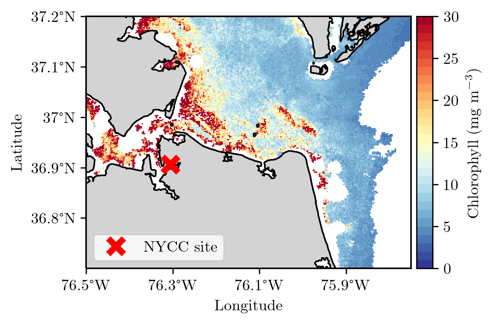

# Studying Harmful Algal Blooms in the Chesapeake Bay
This repository contains scripts used for processing and analysing data collected as part of ODU's time series studysite at the Norfolk Yacht and Country Club (NYCC) in the Lafayette River. 

